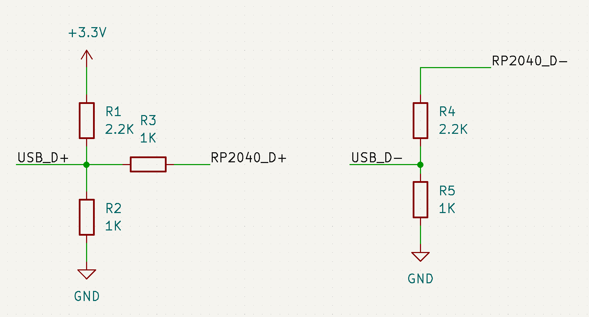

# rp2040-QC2
A QC2.0 driver for the Pi pico (RP2040)

## Circuit

#### Connections

|  Pin   |  RP2040  |
| ----------- | -----------|
| RP2040_D+       | GP02   |
| RP2040_D-     | GP03   |

Based on: https://github.com/septillion-git/QC2Control

